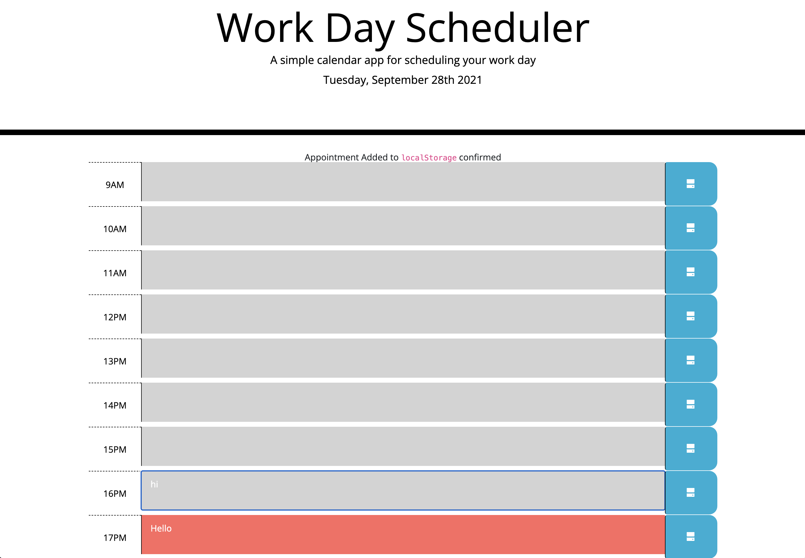

# Work Day Scheduler Starter Code
## Purpose
```
For users with a busy schedule, this application allows users to add important events to a daily planner so that users can manage time effectively. 
```

## Built With
```
- Html
- CSS
- JavaScript
```
## Website

[URL](https://mr2447.github.io/work-day-scheduler/)
[GitHub repo](https://github.com/mr2447/work-day-scheduler)

## Contribution
```
Made with ❤ by Marvin Ren
```
## Screen Shot

